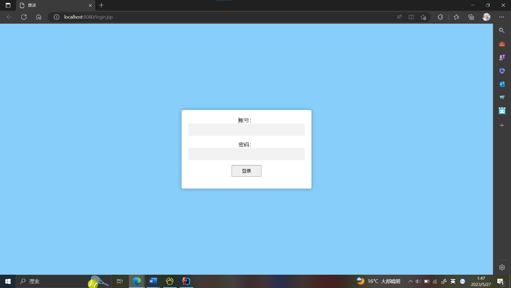
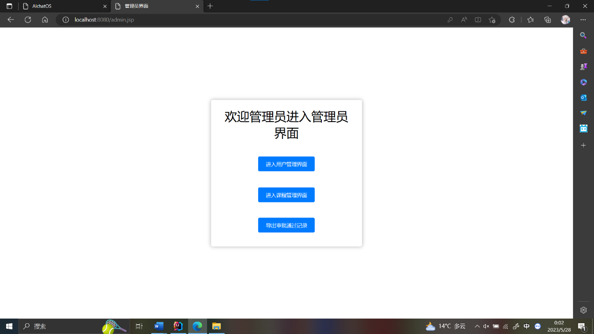
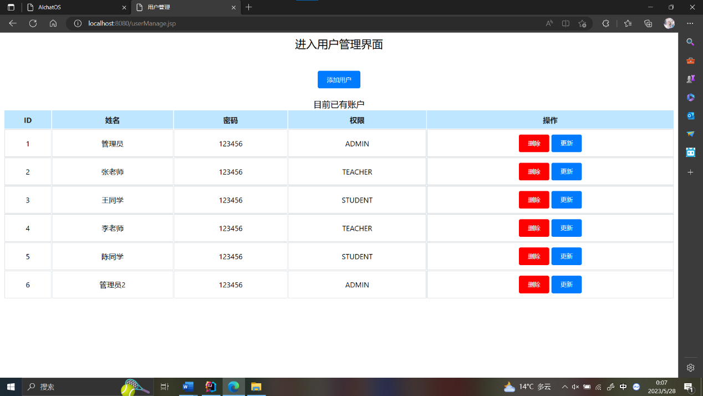
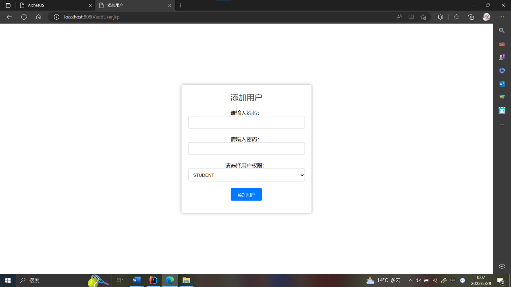
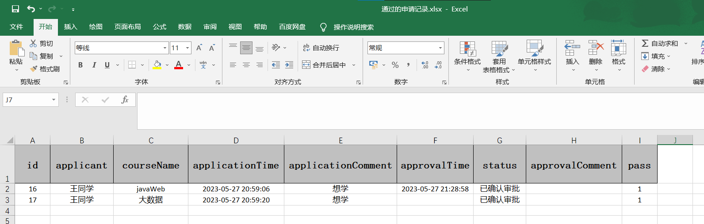
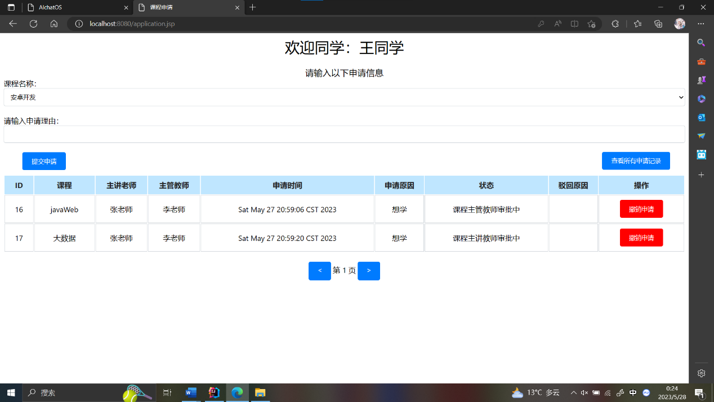
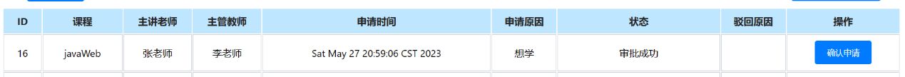
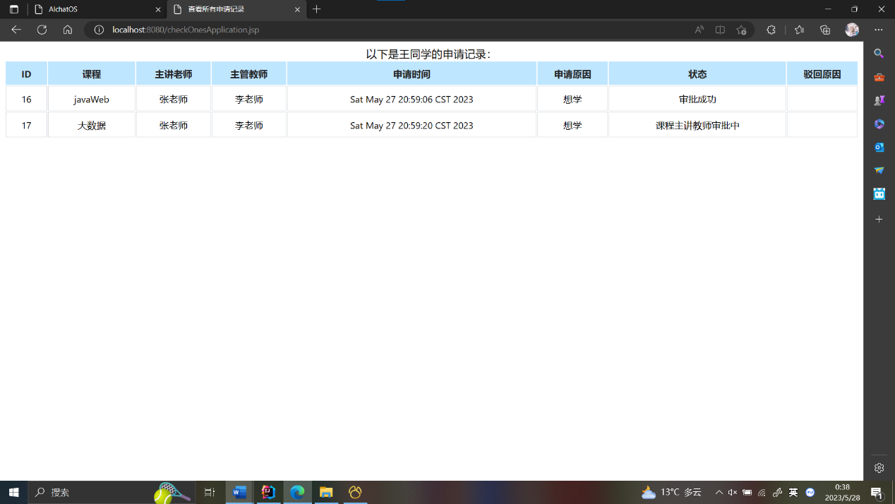
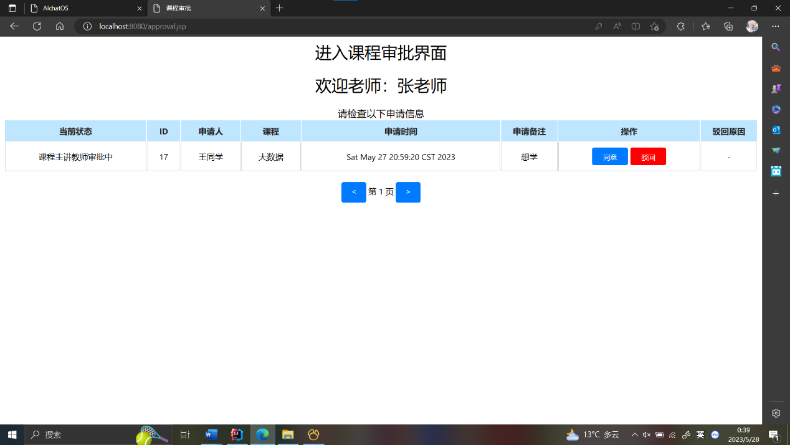
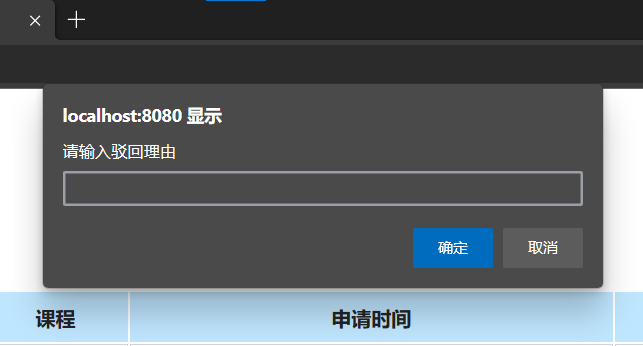

ApprovalSystem使用说明

# 一、项目介绍
## 1. 背景和目的
大学教务管理是一个复杂而繁琐的过程，涉及到学生选课、课程安排、成绩管理、学籍管理等多个环节。传统的手工操作方式存在效率低下、易出错以及信息不一致等问题，需要耗费大量的人力物力资源。
学教务审批系统的目的是通过引入信息技术，提高教务管理的效率和准确性。它旨在实现自动化处理教务事务，简化流程，减少纸质文档的使用，并提供实时的数据分析和报告功能，为教务管理者提供更好的决策依据。
大学教务审批系统的建立对于高校教务管理具有重要意义。它能够提高工作效率，减轻教务管理人员的工作负担，降低错误率，提高数据的准确性。同时，系统还能够加强与学生、教师之间的沟通和互动，提供更好的服务体验，提升教育质量和学生满意度。
## 2. 目标受众
- 教务管理人员：他们是系统的主要使用者，通过系统可以高效地管理学生选课、课程安排、成绩录入等教务事务。
- 学生：学生可以通过系统进行在线选课、查询成绩、查看个人学籍信息等操作，提高了学生的便利性和参与度。
- 教师：教师可以通过系统进行课程安排、成绩录入等操作，减少了繁琐的手工操作，提高了工作效率。
- 高校领导：系统提供实时的数据分析和报告功能，为高校领导提供决策依据，帮助他们更好地管理和规划教务工作。
## 3.文档范围
- 系统概述：对大学教务审批系统的整体架构和功能进行介绍，包括系统的主要模块和关键特性。
- 用户需求：详细描述了不同用户的需求，包括教务管理人员、学生、教师和高校领导的需求，以及系统对这些需求的支持方式。
- 功能设计：具体说明系统的各项功能，并给出相应的流程图和界面设计，以便用户理解和操作。
- 数据管理：描述系统中涉及到的数据结构和数据库设计，包括学生信息、课程信息、成绩信息等。
# 二、安装与配置
## 1.硬件和软件要求
- 硬件和软件要求计算机系统：windows10
- 集成开发工具：IDEA
- 数据库：MySQL
- 操作系统：不限
- Web服务器：Tomcat
## 2. 操作指南
项目运行后，在网页端输入 http://localhost:8080/login 进行登录运行
# 快速入门
用户界面
 

后台管理界面

 
点击“进入用户管理界面”，进入后台管理的用户管理界面

添加用户界面

修改用户信息界面

课程管理的界面逻辑与用户管理类似。
点击“导出审批通过记录”按钮，目标信息导出为xsl文件。
导出结果如下图：

课程申请界面：在申请界面中，学生可以提交自己的选课信息，程序将申请信息保存在数据库中，传递的数据包括applicant（int）、cid（int）与applicationComment（String）。

当课程状态不为“COMPLETE”时，操作状态变为“撤销申请”；
当课程状态为“COMPLETE”时，操作状态为“确认申请”

查看所有申请记录界面

进入审批界面

点击驳回，填写驳回理由

# 四、功能说明
## 1.	在线课程申请模块功能：
### 1.1	学生登录功能
已有账号学生可以在线登录到申请系统中。
用户账户数据可预先存储到数据库中。
### 1.2	在线申请功能
学生登录后，在可选课程列表中，选择要申请的课程。
每次申请只能选择一门课程，不可重复申请。
申请课程时，应填写必要的申请信息，如：申请原因、上传证明等。
课程详细数据可预先存储到数据库中。
### 1.3	已申请课程，审批进度查询功能
审批过程中的申请可以进行进度查询。
审批状态有：申请已提交、课程主讲教师审批中、课程主管教师审批中、审批成功、申请驳回。
审批结束后，也就是审批状态为成功或者驳回，学生可以点击确认，完成本次申请。
结束本次申请后，在进度查询功能中不能再看到该条申请信息。
被驳回申请的课程，可线下沟通后，再次重新提交新的申请。
### 1.4	已申请课程审批记录查询功能
学生可查询本人已申请的全部记录，包括审批通过和驳回的记录。
申请记录可使用分页显示，可使用多条件查询。
## 2.	在线审批模块功能：
### 2.1	课程申请审批功能
已有教师角色账号的教师可登录审批功能。
教师角色用户细分为：课程主讲教师和主管教师，主讲教师为该门课程的第一审批人，主管教师为第二审批人。
具体课程的主讲和主管教师对应关系数据，可预先存储到数据库中。
如果已提交的申请不符合申请条件，可以驳回，但驳回必须填写具体的原因，以便学生再次提交新的申请。
### 2.2	已审批申请查询功能
教师可查询已审批的申请，查询结果可使用分页显示，可使用多条件查询。
## 3.	额外功能：
在系统基本功能（实验内容1、2）基础之上，实现额外功能，使系统功能更加完善。
### 3.1	系统后台
系统用户管理、课申请课程管理、用户审批权限管理（课程与审批教师关系）、审批记录查询、导出已审批通过记录等功能。
### 3.2	创建审批流
可根据具体要求，动态创建课程审批流程，可动态指定不同类别课程的审批步骤及审批人。
## 4.	拓展需求：
系统设计时需考虑系统的延展性、兼容性、可用性、通用性、健壮性、跨平台及持续集成，不仅能满足现有需要，也要适应未来发展的能力。
### 4.1 适应兼容性，系统应使用持久化层框架（MyBatis）
### 4.2 适应通用性，系统应采用MVC设计模式
### 4.3 适应可用性，系统界面需布局合理，用户使用方便快捷，用户体验好

# 技术支持
  联系信息：作者BellGhost，联系邮箱903283029@qq.com
